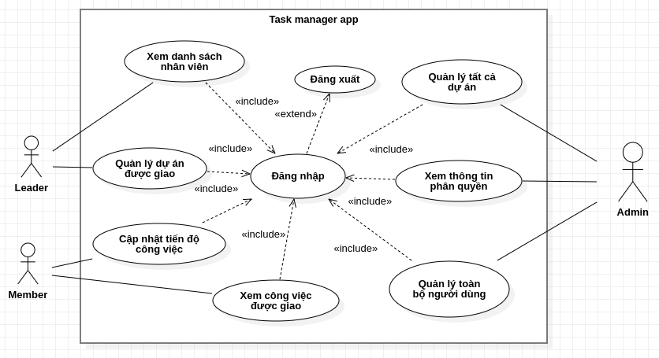
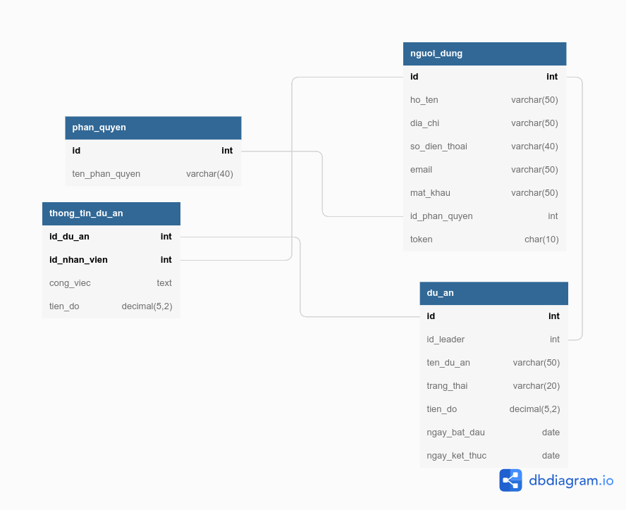

# Ứng dụng quản lý  công việc của nhân viên 

## 1. Yêu cầu 
Xây dựng hệ thống quản lý công việc nhân viên công ty với các yêu cầu sau:
- Hệ thống cho phép quản trị hệ thống (ADMIN) đăng nhập và thêm mới, sửa, xóa,
xem thông tin, cấp quyền cho nhân viên.
- Hệ thống đảm bảo cho “quản lý dự án” (LEADER) có thể dễ dàng đăng nhập thêm
mới, sửa, xóa, xem thông tin dự án. Đồng thời có thể thêm nhân viên vào dự án và phân công công việc cho từng nhân viên thuộc dự án.
- Hệ thống cũng cho phép “quản lý dự án” có thể theo dõi các thống kê về tiến độ công việc của từng nhân viên trong mỗi dự án.
- Hệ thống cho phép nhân viên (MEMBER) đăng nhập với tư cách thành viên, cập nhật tiến độ công việc. Xem các thống kê về tiến độ của các việc đã và đang thực hiện.
- Hệ thống cũng cho phép quản trị hệ thống xem các thống kê về tiến độ các dự án.

## 2. Phân tích hệ thống 
### 2.1 Use-case 
 

     

### 2.2 Database
 

    

### 2.3 Công nghệ 
- Java Servlet, Filter, JSP, JSTL, Cookie
- MySQL server, Hibernate
- Bootstrap

## 3. Demo

